# Updated ER Diagram — DroneZone (Post Jul 10 Meeting)

## Changes Applied
| # | Table | Change |
|---|-------|--------|
| A | `user_roles` | **Removed** `granted_by` column |
| B | `provider_profiles` | **Added** `created_by`, `updated_by` (audit trail) |
| C | `users` | **Added** `created_by`, `updated_by` (audit trail) |
| E | `service_requests` | **Updated** status enum → draft, in_approval, review, approved, rejected, in_progress, completed, cancelled |

---

## Mermaid Code

```mermaid
---
config:
  theme: redux-color
---
erDiagram

    users {
        uuid id PK "Primary Key — UUID v4"
        varchar(255) email UK "Unique — Login credential — Indexed"
        varchar(20) phone UK "Unique — OTP and phone login — Indexed"
        varchar(255) password_hash "NOT NULL — bcrypt or argon2 hashed"
        varchar(100) first_name "NOT NULL — Legal first name"
        varchar(100) last_name "NOT NULL — Legal last name"
        boolean is_active "DEFAULT true — Admin can disable account"
        boolean email_verified "DEFAULT false — Gates request creation"
        boolean phone_verified "DEFAULT false — OTP verification flag"
        timestamp last_login_at "NULL — Tracks last successful login"
        varchar(50) last_login_ip "NULL — IP address of last login"
        integer failed_login_attempts "DEFAULT 0 — Account lockout counter"
        timestamp locked_until "NULL — Temporary lockout expiry"
        uuid created_by "NULL — References users.id — Who created this record"
        uuid updated_by "NULL — References users.id — Who last modified this record"
        timestamp deleted_at "NULL — Soft delete marker"
        timestamp created_at "NOT NULL — Auto-set on insert"
        timestamp updated_at "NOT NULL — Auto-set on update"
    }

    roles {
        uuid id PK "Primary Key — UUID v4"
        varchar(50) name UK "UNIQUE NOT NULL — customer | provider | admin"
        varchar(255) description "NULL — Human-readable role description"
        boolean is_system_role "DEFAULT true — Cannot be deleted by admin"
        timestamp created_at "NOT NULL — Auto-set on insert"
    }

    user_roles {
        uuid id PK "Primary Key — UUID v4"
        uuid user_id FK "NOT NULL — References users.id — Indexed"
        uuid role_id FK "NOT NULL — References roles.id — Indexed"
        timestamp assigned_at "NOT NULL — When role was granted"
        timestamp revoked_at "NULL — When role was removed (soft revoke)"
    }

    customer_profiles {
        uuid id PK "Primary Key — UUID v4"
        uuid user_id FK "UNIQUE NOT NULL — References users.id — 1:1 mapping"
        varchar(100) display_name "NULL — Public-facing name"
        date date_of_birth "NULL — Optional demographic data"
        varchar(20) gender "NULL — male | female | other | prefer_not_to_say"
        uuid default_address_id FK "NULL — References addresses.id — Preferred address"
        varchar(20) preferred_language "DEFAULT en — Language preference"
        varchar(50) preferred_contact_method "DEFAULT phone — phone | email | whatsapp"
        integer total_requests_created "DEFAULT 0 — Denormalized counter for dashboard"
        integer total_requests_completed "DEFAULT 0 — Denormalized counter for dashboard"
        timestamp created_at "NOT NULL — Auto-set on insert"
        timestamp updated_at "NOT NULL — Auto-set on update"
    }

    addresses {
        uuid id PK "Primary Key — UUID v4"
        uuid user_id FK "NOT NULL — References users.id — Indexed"
        varchar(50) label "NULL — Home | Office | Site | Warehouse"
        varchar(255) address_line_1 "NOT NULL — Street address"
        varchar(255) address_line_2 "NULL — Apartment, suite, floor"
        varchar(100) city "NOT NULL — City name"
        varchar(100) state "NOT NULL — State or Province"
        varchar(20) postal_code "NOT NULL — PIN or ZIP code"
        varchar(10) country "DEFAULT IN — ISO 3166-1 alpha-2"
        decimal(10_7) latitude "NULL — GPS latitude for geocoding"
        decimal(10_7) longitude "NULL — GPS longitude for geocoding"
        boolean is_default "DEFAULT false — Only one default per user"
        boolean is_verified "DEFAULT false — Address verification flag"
        timestamp created_at "NOT NULL — Auto-set on insert"
        timestamp updated_at "NOT NULL — Auto-set on update"
    }

    drones {
        uuid id PK "Primary Key — UUID v4"
        uuid owner_id FK "NOT NULL — References users.id — Indexed"
        varchar(100) model "NOT NULL — Drone model name"
        varchar(100) manufacturer "NOT NULL — Manufacturer or brand"
        varchar(100) serial_number UK "UNIQUE NOT NULL — Hardware identifier"
        varchar(50) registration_number "NULL — DGCA UIN if registered"
        varchar(50) drone_type "NULL — quadcopter | hexacopter | fixed_wing | hybrid"
        decimal(6_2) weight_kg "NULL — Takeoff weight in kilograms"
        date purchase_date "NULL — When customer purchased drone"
        varchar(20) warranty_status "DEFAULT unknown — active | expired | unknown"
        date warranty_expiry_date "NULL — When warranty expires"
        varchar(20) condition "DEFAULT unknown — excellent | good | fair | damaged | unknown"
        text notes "NULL — Customer notes about the drone"
        timestamp last_serviced_at "NULL — Date of most recent service"
        timestamp deleted_at "NULL — Soft delete marker"
        timestamp created_at "NOT NULL — Auto-set on insert"
        timestamp updated_at "NOT NULL — Auto-set on update"
    }

    provider_profiles {
        uuid id PK "Primary Key — UUID v4"
        uuid user_id FK "UNIQUE NOT NULL — References users.id — 1:1 mapping"
        varchar(200) business_name "NOT NULL — Legal registered business name"
        varchar(50) business_registration_number "NULL — GST or trade registration ID"
        varchar(100) business_type "NULL — sole_proprietorship | partnership | pvt_ltd | llp"
        integer equipment_class "NULL — 1=Premium | 2=Standard | 3=Basic"
        boolean site_verified "DEFAULT false — Sales partner physical verification"
        uuid verified_by "NULL — References users.id — Admin who verified"
        varchar(100) service_area_city "NULL — Primary service city"
        varchar(100) service_area_state "NULL — Primary service state"
        varchar(20) service_area_pincode "NULL — Primary service pincode"
        decimal(6_2) service_radius_km "DEFAULT 25.00 — How far provider travels"
        varchar(20) status "DEFAULT pending — pending | in_review | approved | rejected | suspended"
        varchar(255) rejection_reason "NULL — Why admin rejected application"
        text bio "NULL — Provider self-description"
        varchar(255) specializations "NULL — Comma-separated expertise areas"
        integer years_of_experience "NULL — Years in drone servicing"
        integer total_jobs_completed "DEFAULT 0 — Denormalized counter"
        decimal(3_2) average_rating "NULL — Denormalized avg rating for future use"
        integer total_jobs_assigned "DEFAULT 0 — Denormalized counter"
        integer total_jobs_rejected "DEFAULT 0 — Denormalized counter"
        timestamp verified_at "NULL — When admin approved the provider"
        timestamp suspended_at "NULL — When admin suspended the provider"
        uuid created_by "NULL — References users.id — Admin who created this record"
        uuid updated_by "NULL — References users.id — Admin who last modified this record"
        timestamp deleted_at "NULL — Soft delete marker"
        timestamp created_at "NOT NULL — Auto-set on insert"
        timestamp updated_at "NOT NULL — Auto-set on update"
    }

    service_categories {
        uuid id PK "Primary Key — UUID v4"
        varchar(100) name UK "UNIQUE NOT NULL — Repair | Inspection | Maintenance | Firmware Update"
        varchar(255) description "NULL — Detailed category description"
        varchar(50) icon "NULL — Icon identifier for frontend display"
        boolean is_active "DEFAULT true — Admin can deactivate"
        integer sort_order "DEFAULT 0 — Controls display ordering"
        integer total_requests "DEFAULT 0 — Denormalized request count"
        timestamp created_at "NOT NULL — Auto-set on insert"
        timestamp updated_at "NOT NULL — Auto-set on update"
    }

    service_requests {
        uuid id PK "Primary Key — UUID v4"
        varchar(20) request_number UK "UNIQUE NOT NULL — Auto-generated REQ-10001"
        uuid customer_id FK "NOT NULL — References users.id — Who created this"
        uuid drone_id FK "NOT NULL — References drones.id — Which drone"
        uuid category_id FK "NOT NULL — References service_categories.id — Type of service"
        uuid service_address_id FK "NOT NULL — References addresses.id — Where service happens"
        varchar(200) title "NOT NULL — Short summary of the issue"
        text description "NOT NULL — Detailed issue description from customer"
        varchar(20) priority "DEFAULT medium — low | medium | high | urgent"
        varchar(20) status "DEFAULT draft — draft | in_approval | review | approved | rejected | in_progress | completed | cancelled"
        varchar(20) urgency_level "NULL — normal | same_day | next_day | within_week"
        date requested_completion_date "NULL — Customer expected completion date"
        date actual_completion_date "NULL — When job was actually completed"
        boolean requires_onsite_visit "DEFAULT true — Does provider need to travel"
        text cancellation_reason "NULL — Why request was cancelled"
        uuid cancelled_by "NULL — References users.id — Who cancelled"
        text admin_notes "NULL — Internal notes by admin (not visible to customer)"
        integer revision_count "DEFAULT 0 — How many times request was revised"
        timestamp submitted_at "NULL — When customer submitted the request"
        timestamp reviewed_at "NULL — When admin first reviewed"
        uuid reviewed_by "NULL — References users.id — Admin who reviewed"
        timestamp assigned_at "NULL — When first provider was assigned"
        timestamp completed_at "NULL — When job was marked complete"
        timestamp cancelled_at "NULL — When request was cancelled"
        timestamp deleted_at "NULL — Soft delete marker"
        timestamp created_at "NOT NULL — Auto-set on insert"
        timestamp updated_at "NOT NULL — Auto-set on update"
    }

    job_assignments {
        uuid id PK "Primary Key — UUID v4"
        uuid service_request_id FK "NOT NULL — References service_requests.id — Indexed"
        uuid provider_id FK "NOT NULL — References users.id — Which provider"
        uuid assigned_by FK "NOT NULL — References users.id — Which admin assigned"
        varchar(20) status "DEFAULT pending — pending | accepted | rejected | in_progress | on_hold | completed | cancelled"
        integer assignment_sequence "DEFAULT 1 — 1st assignment, 2nd after rejection, etc."
        boolean is_active_assignment "DEFAULT true — Only one active per request"
        text provider_notes "NULL — Provider remarks on acceptance"
        text admin_assignment_notes "NULL — Admin notes when assigning"
        date proposed_completion_date "NULL — Provider counter-proposal date"
        integer additional_days_requested "DEFAULT 0 — Extra days over customer request"
        text additional_days_reason "NULL — Why provider needs more time"
        boolean customer_approved_extension "NULL — Did customer approve extra days"
        text rejection_reason "NULL — Why provider rejected the assignment"
        decimal(12_2) estimated_cost "NULL — Provider preliminary cost estimate"
        varchar(20) visit_type "DEFAULT onsite — onsite | remote | pickup_delivery"
        date scheduled_visit_date "NULL — Planned visit date"
        varchar(10) scheduled_visit_time "NULL — Planned visit time slot"
        text completion_summary "NULL — Provider summary after completing job"
        timestamp assigned_at "NOT NULL — When admin created this assignment"
        timestamp responded_at "NULL — When provider accepted or rejected"
        timestamp started_at "NULL — When provider started working"
        timestamp completed_at "NULL — When provider marked job complete"
        timestamp cancelled_at "NULL — When assignment was cancelled"
        uuid cancelled_by "NULL — References users.id — Who cancelled"
        text cancellation_reason "NULL — Why assignment was cancelled"
        timestamp created_at "NOT NULL — Auto-set on insert"
        timestamp updated_at "NOT NULL — Auto-set on update"
    }

    job_status_history {
        uuid id PK "Primary Key — UUID v4"
        uuid job_assignment_id FK "NOT NULL — References job_assignments.id — Indexed"
        varchar(20) from_status "NOT NULL — Previous status value"
        varchar(20) to_status "NOT NULL — New status value"
        uuid changed_by FK "NOT NULL — References users.id — Who triggered change"
        varchar(20) changed_by_role "NOT NULL — customer | provider | admin | system"
        varchar(20) change_source "NOT NULL — manual | system | api | scheduled"
        varchar(100) change_trigger "NULL — What action caused this change"
        text notes "NULL — Human-readable context for the change"
        varchar(50) ip_address "NULL — IP address of the actor"
        varchar(255) user_agent "NULL — Browser or app identifier"
        integer duration_in_previous_status_mins "NULL — How long was it in from_status"
        timestamp created_at "NOT NULL — Immutable timestamp — Indexed"
    }

    users ||--o{ user_roles : "has roles"
    roles ||--o{ user_roles : "assigned to users"
    users ||--o| customer_profiles : "has customer profile (1:1)"
    users ||--o| provider_profiles : "has provider profile (1:1)"
    users ||--o{ addresses : "has saved addresses"
    users ||--o{ drones : "owns drones"
    addresses ||--o| customer_profiles : "set as default address"
    users ||--o{ service_requests : "creates requests (as Customer)"
    drones ||--o{ service_requests : "serviced in request"
    service_categories ||--o{ service_requests : "categorizes request"
    addresses ||--o{ service_requests : "service performed at"
    service_requests ||--o{ job_assignments : "assigned to provider via"
    users ||--o{ job_assignments : "works on (as Provider)"
    users ||--o{ job_assignments : "assigns provider (as Admin)"
    job_assignments ||--o{ job_status_history : "lifecycle tracked by"
    users ||--o{ job_status_history : "action performed by"
```

